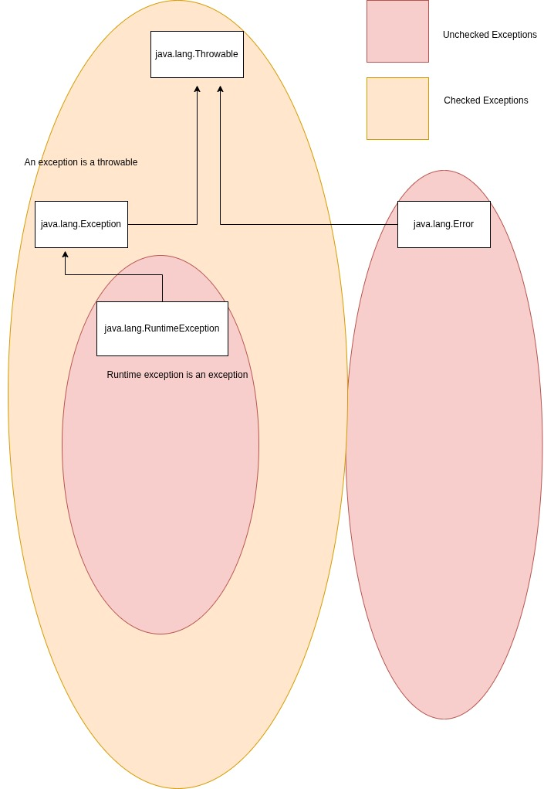

## Exceptions
 
  Java'dan önce (özellilkle C gibi dillerde), hata yönetimi büyük ölçüde hata kodları (error codes) ile yapılırdı. 
JLS bu hata kodlarını "funny values" olarak belirtir. Buna göre bir fonksiyon, başarılıysa 0, bir hata oluştuysa, 
  -1, 1, 2, 12000, gibi farklı tamsayılar döndürürdü. 

> JLS: ***Explicit use of throw statements provides an alternative to the old-fashioned style
of handling error conditions by returning funny values, such as the integer value
-1 where a negative value would not normally be expected.***
  
#### Bu yaklaşımın temel sorunları: 
1. **Kod Kirliliği:** Programcı, her fonksiyon çağrısından sonra bu hata kodunu kontrol etmek zorundaydı. Bu durum, 
ana iş mantığının(business logic) içine ```if(errorCode != 0)``` blokların serpiştirilmesine neden olur, kodun okunabilirliğini 
bozardı.
2. **Unutulma Riski:** Programcı hata kodunu kontrol etmeyi unutursa, program hatalı bir durumda çalışmaya devam eder.
Bu durumda çok daha sonra, ilgisiz bir yerde çökebilirdi(silent failure). 

 > JLS'de 11. Bölümde bu duruma atıfta bulunmuştur :  
 > ***... Experience shows that
 too often such funny values are ignored or not checked for by callers, leading to
 programs that are not robust, exhibit undesirable behavior, or both.***
 
3.**Yetersiz Bilgi:** Bir tamsayı (error code), hatanın nedenini, nerede oluştuğunu ve bağlamı hakkında yeterli bilgi 
taşıyamazdı.

 **Java'nın Çözümü:** Java'nın tasarımcıları, C++'ın ```try-catch``` mekanizmasından esinlenerek bu duruma alternatif ve 
 daha sağlam (robust) bir sistem kurmayı amaçladılar.
 > **Temel Felsefe:** Hata yönetimi kodunu, ana iş akışı kodundan ayırmak.
 
### JLS Perspektifi
 JLS, bilindiği gibi kuralları tanımlar.JLS Bölüm 11 ("Exceptions"), bu mekanizmayı resmi olarak üç kategoriye ayırır.
Hierarşinin tepesinde ```java.lang.Throwable``` sınıfı bulunur.
> JLS 11.1: ***An exception is represented by an instance of the class Throwable (a direct subclass
of Object) or one of its subclasses.***

1. **Exceptions(İstisnalar):**
- Bunlar, ```java.lang.Exception``` sınıfından türeyen sınıflardır.
>JLS: ***Exception is the superclass of all the exceptions from which ordinary programs
may wish to recover.***

2. **Runtime Exceptions:**
- Bunlar, ```java.lang.RuntimeException``` sınıfından türeyen sınıflardır. ```RuntimeException``` sınıfı da 
```java.lang.Exception``` sınıfından türemiştir.Böyle olmasına karşın JVM tarafından ayrı bir kategori olarak 
işlenir.
Genellikle programlama hatalarını(undesired expression evaluation), veya kurtarılması mümkün olmayan mantık hatalarını 
temsil ederler.```NullPointerException``` alınıyorsa, bunu ```catch``` ile yakalamak yerine (handle) kod düzeltilmelidir.

3. **Errors:**
- Bunlar, ```java.lang.Error``` sınıfından türeyen ciddi sorunlardır. (Örn: ```OutOfMemoryError```, ```StackOverflowError```)
JVM'in kendisinde veya sistem kaynaklarında meydana gelen, uygulamanın müdehale edip kurtaramayacağı 
_felaket_ senaryolarını temsil ederler. Bunları yakalamaya(handle) çalışmak genellikle tavsiye edilmez. 





1. **Unchecked Exceptions:**
  JLS, run-time exception sınıflarını ve error sınıflarını _unchecked exception_ olarak kategorize eder.
2. **Checked Exceptions:**
  JLS, unchecked exception sınıflarının dışında kalan sınıfları bu kategoriye dahil eder. Daha açık bir ifadeyle;
  ```Throwable``` ve onun tüm alt sınıfları, ```RuntimeException``` sınıfı ve onun alt sınıfları ve ```Error``` sınıfı ve 
onun alt sınıfları hariç olmak üzere, _checked exception_'dır.
 > Derleyici seviyesinde programcıyı öngörülebilir ve kurtarılabilir hatalara karşı önlem almaya zorlamaktır.Örneğin, 
Dosyanın bulunamaması (```FileNotFoundException```) bir programlama hatası değil, programın çalışma anında karşılaşabileceği
 beklenen bir durumdur.
 
İstisnai bir durum(exceptional condition), mevcut metodun ya da kapsamın(scope) yürütülmeye devam etmesini engelleyen 
bir problemdir.Mevcut bağlamda, zorlukla bir şekilde başa çıkmak için yeterli bilgiye sahip olunan normal bir problem 
ile istisnai durumu ayırt etmek önemlidir. İstisnai durumda işlem sürdüremeyiz çünkü problemi o anki bağlamda ele alabilmek 
için yeterli bilgiye sahip değilizdir.Yapabileceğimiz tek şey mevcut bağlamdan "dışarı atlamak" ve problemi daha üst bir 
bağlama havale etmektir.Bir _exception_ fırlatıldığında(throw) olan şey tam olarak budur.

 Mesela bölme işlemi basit bir örnektir. Sıfıra bölmek üzereysek, bu durumu kontrol etmek değerlidir.Ancak, paydanın 
sıfır olması ne anlama gelir ? Belki de uğraşılan belirli metot bağlamında, paydası sıfır olan değeri nasıl ele alacağımızı 
biliyoruzdur. Fakat bu beklenmedik bir değer ise, bununla başa çıkamayız ve bu yürütme yolunda devam etmek yerine bir 
_exception_ fırlatmamız gerekir.

Bir _exception_ fırlattığımızda, birkaç şey gerçekleşir. Önce, _exception_ nesnesi tıpkı herhangi bir Java nesnesi gibi 
_heap_ üzerinde ```new``` ile oluşturulur. Ardından mevcut yürütme yolu durdurulur ve _exception_ nesnesinin referansı 
mevcut bağlamdan dışarı ***fırlatılır.*** Bundan sonra _exception_ işleme mekanizması devreye girer ve program yürütmeye 
devam etmek için _uygun bir yer aramaya başlar._ Bu uygun yer, programın ya başka bir yöntem denemek ya da kaldığı yerden 
devam etmek üzere sorunu telafi etmekle görevli _exception handler_'dır(İstisna Yakalayıcısı).

Exception fırlatmanın basit bir örneği olarak, ```t``` adlı bir nesne referansını ele alalım. Initialize edilmemiş bir referans 
almış olabiliriz, bu yüzden bu referansı kullanmadan önce kontrol ederiz. Hata hakkında bilgiyi daha geniş bir bağlama aktarmak 
için, bilgimizi temsil eden bir nesne oluşturup bunu mevcut bağlamın dışına ***fırlatabiliriz.*** Buna **throwing an exception** denir.

```java
   if(t == null)
      throw new NullPointerException(); 
```

```java
  public static void main(String[] args) {

        System.out.println(division(5, 0));
    }

    private static int division(int dividend, int divisor){
        if(divisor == 0)
            throw new ArithmeticException();
        return dividend / divisor;
    }
```

Bu kodlar exception fırlatır. Bu da **mevcut bağlamda**  sorunla ilgili sorumluluğu bırakmamıza olanak tanır. _Sanki başka bir yerde 
sihirli bir şekilde ele alınır._

Exception'lar, yaptığımız her şeyi bir "transaction/işlem" olarak düşünmemize izin verir.

## Exception Handling

Bir exception'un nasıl yakalandığını görmek için önce **guarded region** kavramını tanımlayalım.Bu, exception üretilebilcek 
kod bölümüdür ve onu, bu exception'ları ele alacak kod izler.

 ### ```try``` Bloğu
Bir metodun içindeyken bir exception fırlatılırsa(ya da metodun içinde çağrılan başka bir metot exception fırlatırsa),
fırlatma işlemi sırasında o metoddan çıkılır.Fırlatmanın metoddan çıkması istenmiyorsa, exception'u yakalayacak özel bir 
block kurulabilir. Buna, çeşitli metot çağrıları veya exception fırlatabilecek kod **"denendiği"** için ```try``` **bloğu** denir.
```try``` bloğu, ```try``` anahtar kelimesiyle başlayan sıradan bir kapsamdır (scope).

 ```java
    
     try {
             // guarded region --- exception üretebilecek kod
        }
    
```
### Exception Handlers
  Fırlatılan exception bir yere "düşer". Bu yer istisna yakalayıcısıdır(exception handler) ve her exception için bir tane 
yazılır. Handler'lar  ```try``` bloğunu hemen takip eder ve ```catch``` anahtar kelimesiyle belirtilir.

```java
 

    try{
        
        // exception üretebilecek kod
    }catch(Type1Exception t1){
        // Type1 exception'larını ele al
    }catch(Type2Exception t2){
        // Type2 exception'larını ele al
    }


```
> Her ```catch``` ifadesi, belirli bir türden **yalnızca bir** argüman alan özel,küçük bir ***metoda*** benzer.


Handler'lar yani ```catch``` blokları ```try``` bloğunun **hemen ardından** gelmelidir.Bir exception fırlatıldığında, 
işleme mekanizması exception türüyle eşleşen argümana sahip **ilk** yakalayıcıyı(handler) arar. Ardından o ```catch``` 
bloğuna girilir ve exception **ele alınmış**(handling) sayılır. İlgili ```catch``` bulununca arama durur. Yalnızca eşleşen 
```catch``` çalışır. ```switch``` deyimindeki gibi ```break``` koyulmadığında kalanların çalıştığı gibi bir durum yoktur !

> Dikkat: ```try``` bloğu içerisinde farklı metot çağrıları **aynı** exception üretebilir; ancak bunun için tek bir yakalayıcı(handler) 
> yeterlidir

```java

public static void main(String[] args) {

        System.out.println("flow is started...");

        try {
            System.out.println(division(5, 0));
        } catch (ArithmeticException e) {
            System.out.println("divided by 0(zero)");
        }

        System.out.println("flow is continue...");

    }

    private static int division(int dividend, int divisor) {
        if (divisor == 0)
            throw new ArithmeticException();
        return dividend / divisor;
    }
```

```java
     try {
            System.out.println(division(5, 0));
        } catch (ArithmeticException e) {
            System.out.println("divided by 0(zero)");
        }catch (ArithmeticException e){ // COMPILE-TIME ERROR -- Already defined
            
        }

```

### Custom Exception Classes

 Mevcut Java built-in exception sınıfları tüm olası problem senaryolarını karşılamaz.Java exception hiyerarşisi bildirmemiz 
 gereken tüm hataları öngöremez. Bazen iş akışı gereği özel exception'lara ihtiyaç duyabiliriz. 
 Yukarıda da belirttiğimiz gibi bunun olabilmesi için ```Throwable``` hiyerarşisinde uygun yerde konuşlanmak gerekebilir. 
 
Kendi istisna(exception) sınıfınızı oluşturmak için mevcut bir exception sınıfından kalıtım almanız önerilir. Tercihen 
yeni oluşturacağınız exception'a anlamca en yakın olanından miras almanız daha iyi olacaktır.Eğer mevcut hierarşide 
yakın bir exception sınıfı yoksa doğrudan ```Exception``` sınıfından miras alınabilir. 

> Yeni bir exception türü oluşturmanın en basit yolu, derleyicinin sizin için non-arg ctor oluşturmasına izin vermektir. 


```java
// custom exception - checked exception
public class SimpleException extends Exception{
}
```

```java
// custom exception - checked exception
public class SimpleException extends Throwable {
}
```
```java
// custom Runtime exception - unchecked exception
public class SimpleRuntimeException extends RuntimeException{
}

```


> https://logging.apache.org/log4j/2.x/index.html 


```java
package ba.yzl3514.exceptions;

import java.io.PrintWriter;
import java.io.StringWriter;
import java.util.logging.Logger;

/**
 *
 * @author Onder Sahin
 *
 */
public class LoggingException extends Exception{

    private static Logger logger = Logger.getLogger("LoggingException");

    public LoggingException(){
        StringWriter stringWriter = new StringWriter();
        PrintWriter printWriter = new PrintWriter(stringWriter);
        printStackTrace(printWriter);
        logger.severe(stringWriter.toString());
    }
}


public class LoggingExceptionApp {

    public static void main(String[] args) {

        try {
            throw new LoggingException();
        } catch (LoggingException e) {
            System.err.println("Handler : " + e);
        }

    }

}
```
> OUTPUT : 
> Nov 08, 2025 8:06:37 PM ba.yzl3514.exceptions.LoggingException <init>
SEVERE: ba.yzl3514.exceptions.LoggingException
at ba.yzl3514.main.LoggingExceptionApp.main(LoggingExceptionApp.java:18)
> 
> Handler : ba.yzl3514.exceptions.LoggingException
---
